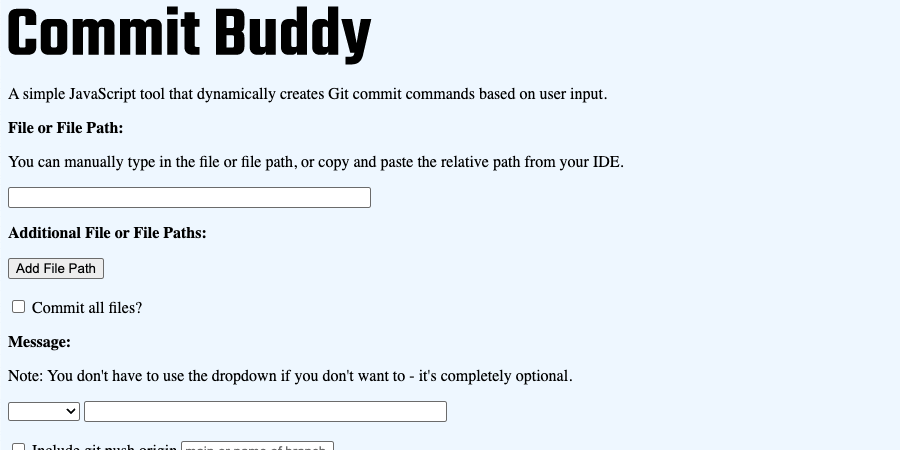
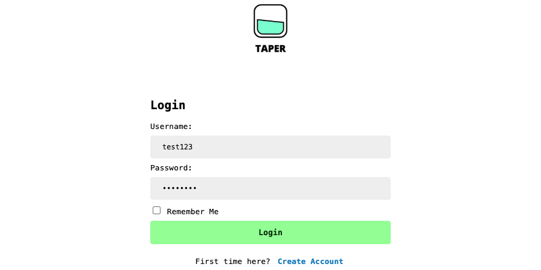
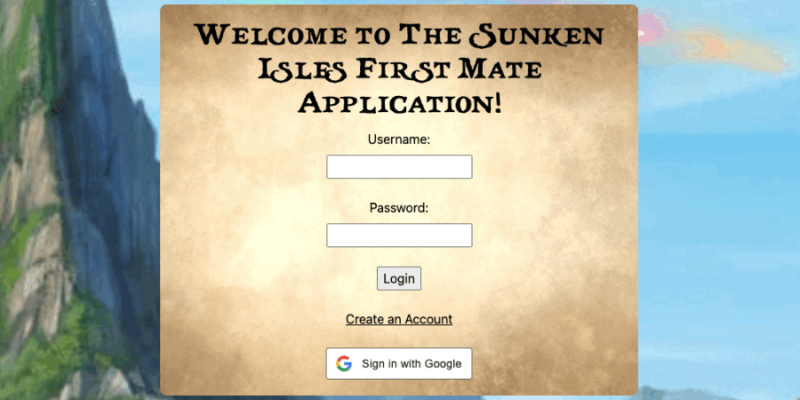
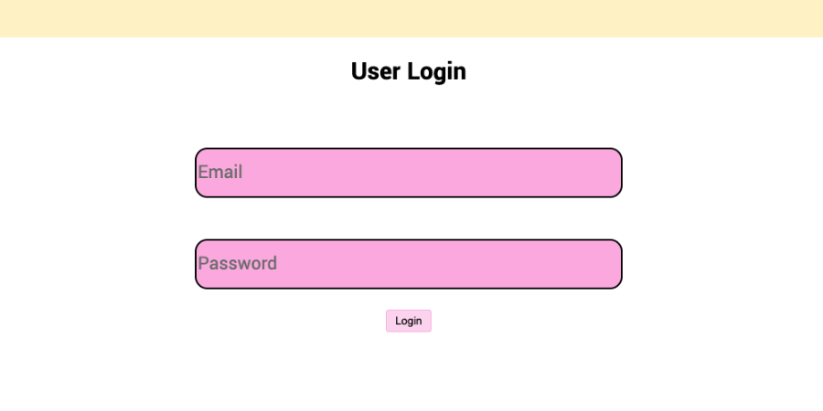

### Hello, I'm Grant! 👋

I'm a software developer with a background in marketing and design, bringing a user-centric mindset, strong communication skills, and attention to detail to full-stack software development. Experienced in building reliable, maintainable applications using React, TypeScript, Node.js, Ruby on Rails, and PostgreSQL, with experience implementing CI/CD pipelines and automated testing. Currently expanding technical skills in Docker and Python to strengthen full-stack development and DevOps knowledge. Passionate about collaborative problem-solving, building well-designed software, and advancing technology that drives exploration, growth, and automation.

Here you'll find a collection of projects I'm currently working on or have worked on in the past. Feel free to take a look around and connect with me on [LinkedIn](https://www.linkedin.com/in/grantdavis303/).

## Personal Projects

### <a href="https://github.com/grantdavis303/commit_buddy_chrome_extension" class="title" target="_blank"> Commit Buddy (now a Chrome Extension!) </a>

[See Commit Buddy in the Chrome Web Store](https://chromewebstore.google.com/detail/commit-buddy/jfidkngbdohmegijjkggecihaokmcgof?authuser=0&hl=en)

A simple JavaScript tool that dynamically creates Git commit commands based on user input.

### <a href="https://github.com/grantdavis303/taper" class="title" target="_blank"> Taper </a>

An educational health and wellness web application that allows users to track their alcoholic unit consumption by entering in values for a drink’s ounces and alcohol-by-volume (ABV) percentage.

## Turing Projects

### <a href="https://github.com/The-Sunken-Isles-First-Mate/first-mate-fe" class="title" target="_blank"> Sunken Isles First Mate </a>

A responsive web application that supports the Sunken Isles Dungeons & Dragons campaign and allows users to track their campaign progress, villager count, available resources, and owned items.

### <a href="https://github.com/habit-heroes/habit-heroes-be" class="title" target="_blank"> Habit Heroes API </a>

A RESTful Ruby on Rails API designed to be called by the Habit Heroes React frontend application.

